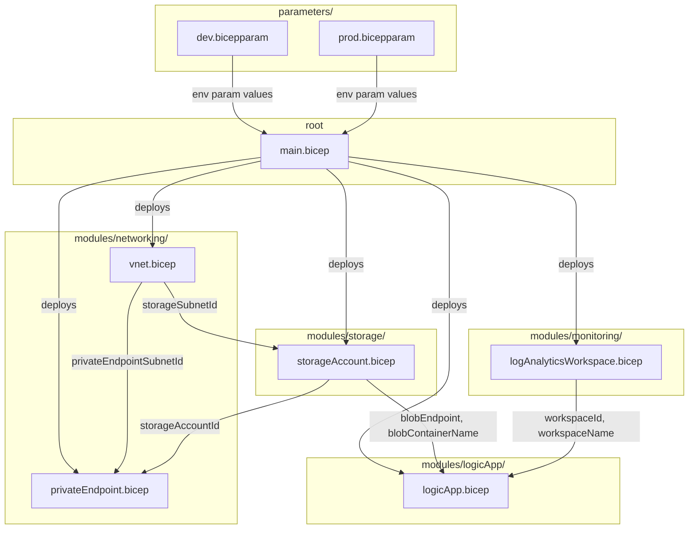

# IaCPOC — Interconnections & Dependencies

## Overview

`main.bicep` is the single orchestrator. It calls every module in dependency
order, captures their `output` values, and passes them as `param` inputs to
the modules that need them. No module calls another module directly — all
wiring goes through `main.bicep`.

---

## Dependency Diagram

> Render this file in VSCode Markdown Preview (install "Markdown Preview Mermaid Support" if needed).



---

## ASCII Fallback Diagram

```
parameters/                         modules/
┌─────────────┐                     ┌─────────────────────────────────────────┐
│dev.bicepparam│─────┐               │                                         │
│prod.bicepparam│────┤               │  monitoring/                            │
└─────────────┘     │               │  └── logAnalyticsWorkspace.bicep        │
                    ▼               │           │ workspaceId                 │
              ┌──────────┐          │           │ workspaceName               │
              │main.bicep│──────────►           │                             │
              └──────────┘          │  networking/                            │
                                    │  ├── vnet.bicep                         │
                                    │  │       │ storageSubnetId ─────────┐   │
                                    │  │       │ privateEndpointSubnetId ─┼─┐ │
                                    │  │       │                          │ │ │
                                    │  └── privateEndpoint.bicep ◄────────┼─┘ │
                                    │              ▲ storageAccountId     │   │
                                    │              │                      │   │
                                    │  storage/    │                      │   │
                                    │  └── storageAccount.bicep ◄─────────┘   │
                                    │          │ storageAccountId              │
                                    │          │ blobEndpoint                  │
                                    │          │ blobContainerName             │
                                    │          │                               │
                                    │  logicApp/                              │
                                    │  └── logicApp.bicep ◄───────────────────┘
                                    │         (consumes blobEndpoint,
                                    │          blobContainerName,
                                    │          workspaceId, workspaceName)
                                    └─────────────────────────────────────────┘
```

---

## Output → Input Map

| Producer module              | Output value(s)                                   | Consumer module               |
|------------------------------|---------------------------------------------------|-------------------------------|
| `networking/vnet.bicep`      | `storageSubnetId`                                 | `storage/storageAccount.bicep`|
| `networking/vnet.bicep`      | `privateEndpointSubnetId`                         | `networking/privateEndpoint.bicep` |
| `storage/storageAccount.bicep` | `storageAccountId`                              | `networking/privateEndpoint.bicep` |
| `storage/storageAccount.bicep` | `blobEndpoint`, `blobContainerName`             | `logicApp/logicApp.bicep`     |
| `monitoring/logAnalyticsWorkspace.bicep` | `workspaceId`, `workspaceName`      | `logicApp/logicApp.bicep`     |

---

## Notes

- **`privateEndpoint.bicep`** is the only module with two producers as dependencies
  (it needs both the subnet from networking and the resource ID from storage).
  This is why `main.bicep` must deploy storage before calling the private endpoint module.

- **`logicApp.bicep`** is the only module that consumes outputs from two independent
  branches (storage and monitoring). It is always deployed last.

- **`parameters/*.bicepparam`** files only feed `main.bicep`. They never reference
  individual modules directly.
